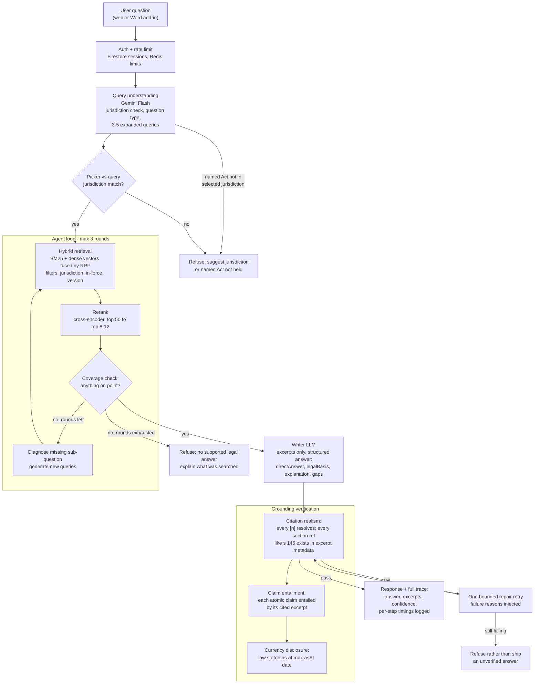
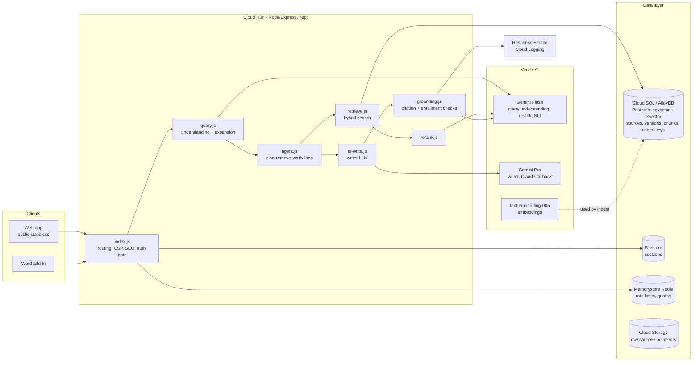
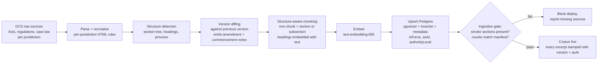
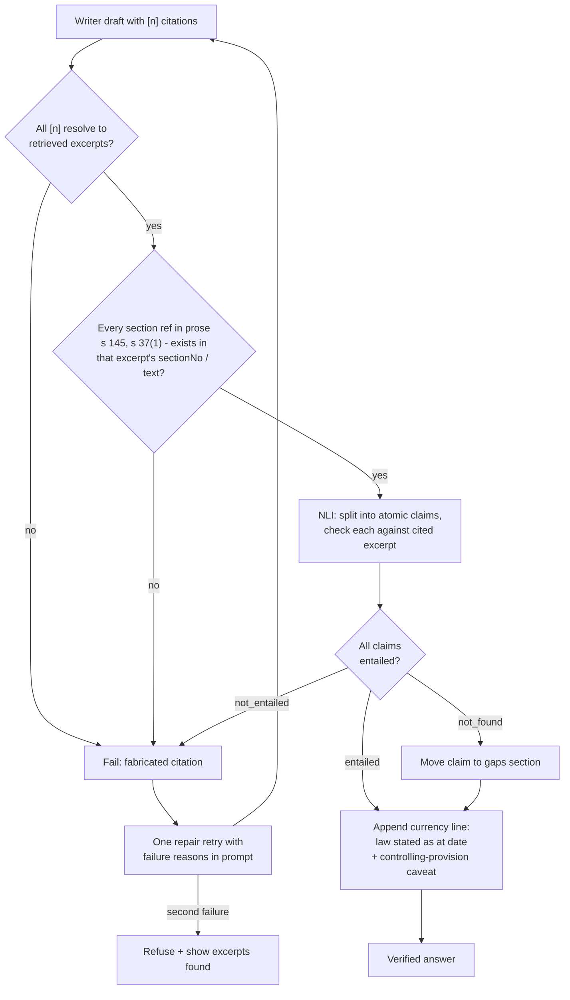
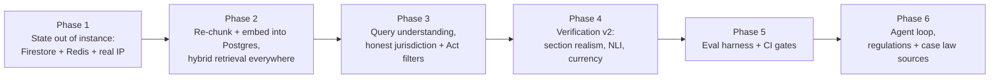

# NOMOS v2 — Architecture Diagrams (Mermaid)

Companion to [REDESIGN.md](REDESIGN.md). These diagrams render on GitHub, GitLab, and any Mermaid Live viewer (paste the block into https://mermaid.live).

---

## 1. Core query flow — plan, retrieve, verify, answer

---

## 2. GCP system architecture

---

## 3. Ingestion pipeline (CI-gated, Cloud Run job)

---

## 4. Grounding verification detail

---

## 5. Build order

